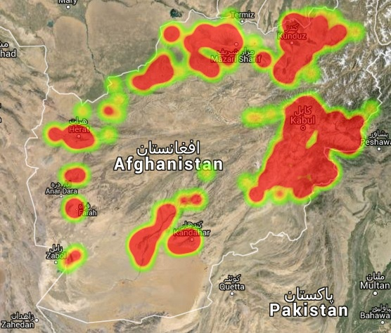
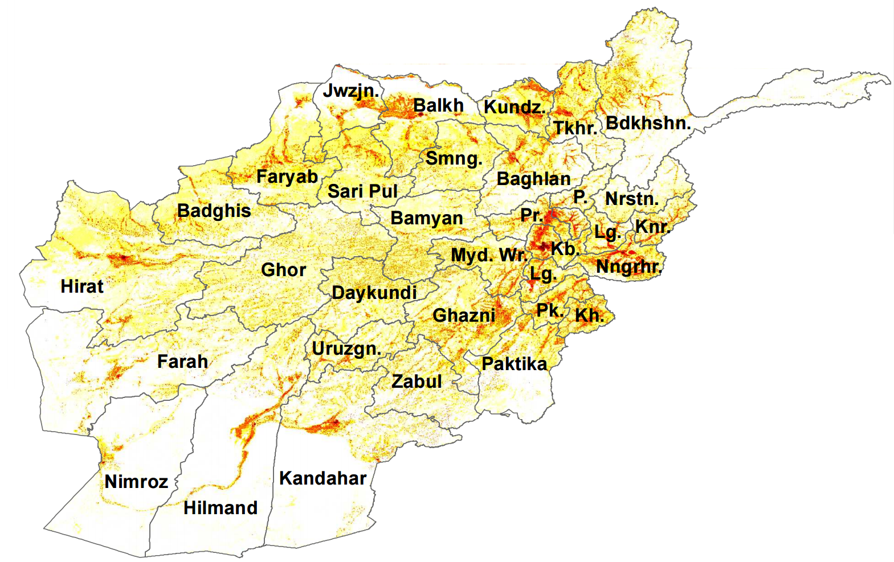

# Afghanistan Population Heat Map

# 

This tiny web app displays a population heat map over Afghanistan on Google Earth.
Take it for a spin [here](http://pixeldoctrine.com/afghanistan-population-heatmap/).
The heat map data loads at different levels of detail as you zoom and pan the map.

## Frontend

The frontend is web application of 46 lines of JavaScript [code](index.html).
jQuery/ajax is used to load heat map data dynamically, and the Google Maps
[API](https://developers.google.com/maps/) is used for both Google Earth and the overlay.

## Backend

If the population data was generated by a mathematical model, it could be calculated by
the backend at runtime. In this hack, however, I'm only using pre-generated data. My
heatmap data is generated by a [Python script](img2coords.py) with an image I found as input:

# 
